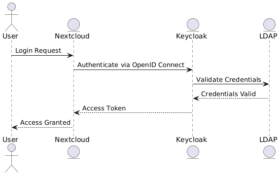

# Keycloak and LDAP Setup Documentation



## Overview
This documentation provides detailed steps to set up Keycloak with LDAP integration using Docker Compose. The setup includes the following services:

- **Keycloak**: Identity and Access Management system
- **PostgreSQL**: Database for Keycloak
- **OpenLDAP**: Lightweight Directory Access Protocol service
- **phpLDAPadmin**: Web interface for managing LDAP
- **Nextcloud**: File sharing and collaboration platform

## Prerequisites
- Docker and Docker Compose installed
- Environment variables configured in a `.env` file

### Environment Variables Example
```env
LDAP_ORGANISATION=YourOrganisation
LDAP_DOMAIN=example.com
LDAP_ADMIN_PASSWORD=adminpassword
PHPLDAPADMIN_LDAP_HOSTS=ldap
PHPLDAPADMIN_HTTPS=false

KC_DB=postgres
KC_DB_URL=jdbc:postgresql://postgres:5432/keycloak
KC_DB_USERNAME=keycloak
KC_DB_PASSWORD=keycloakpassword
KC_BOOTSTRAP_ADMIN_USERNAME=admin
KC_BOOTSTRAP_ADMIN_PASSWORD=admin
KC_HTTP_PORT=8080

POSTGRES_DB=keycloak
POSTGRES_USER=keycloak
POSTGRES_PASSWORD=keycloakpassword
```

## Docker Compose Files

### LDAP Services
File: `docker-compose-ldap.yml`
```yaml
version: '3.8'

services:
  ldap:
    image: docker.arvancloud.ir/osixia/openldap:1.5.0
    container_name: ldap
    environment:
      LDAP_ORGANISATION: ${LDAP_ORGANISATION}
      LDAP_DOMAIN: ${LDAP_DOMAIN}
      LDAP_ADMIN_PASSWORD: ${LDAP_ADMIN_PASSWORD}
    ports:
      - "389:389"
      - "636:636"
    networks:
      - keycloak-net

  ldap-admin:
    image: docker.arvancloud.ir/osixia/phpldapadmin:0.9.0
    container_name: ldap-admin
    environment:
      PHPLDAPADMIN_LDAP_HOSTS: ${PHPLDAPADMIN_LDAP_HOSTS}
      PHPLDAPADMIN_HTTPS: ${PHPLDAPADMIN_HTTPS}
    ports:
      - "8081:80"
    depends_on:
      - ldap
    networks:
      - keycloak-net

networks:
  keycloak-net:
    driver: bridge
```

### Keycloak and Database
File: `docker-compose-keycloak.yml`
```yaml
version: '3.8'

services:
  keycloak:
    image: quay.io/keycloak/keycloak:26.1.3
    container_name: keycloak
    command: start-dev
    environment:
      KC_DB: ${KC_DB}
      KC_DB_URL: ${KC_DB_URL}
      KC_DB_USERNAME: ${KC_DB_USERNAME}
      KC_DB_PASSWORD: ${KC_DB_PASSWORD}
      KC_BOOTSTRAP_ADMIN_USERNAME: ${KC_BOOTSTRAP_ADMIN_USERNAME}
      KC_BOOTSTRAP_ADMIN_PASSWORD: ${KC_BOOTSTRAP_ADMIN_PASSWORD}
      KC_HTTP_PORT: ${KC_HTTP_PORT}
    ports:
      - "8080:8080"
    depends_on:
      - postgres
    networks:
      - keycloak-net

  postgres:
    image: docker.arvancloud.ir/postgres:16
    container_name: postgres
    environment:
      POSTGRES_DB: ${POSTGRES_DB}
      POSTGRES_USER: ${POSTGRES_USER}
      POSTGRES_PASSWORD: ${POSTGRES_PASSWORD}
    ports:
      - "5432:5432"
    networks:
      - keycloak-net

networks:
  keycloak-net:
    driver: bridge
```

## How to Run
1. Clone the repository.
2. Set environment variables in `.env`.
3. Start the services:
```bash
docker-compose -f docker-compose-ldap.yml up -d
docker-compose -f docker-compose-keycloak.yml up -d
```
4. Access the services:
    - Keycloak: `http://localhost:8080`
    - phpLDAPadmin: `http://localhost:8081`

## Configuration
### Keycloak LDAP Integration
1. Login to Keycloak admin panel.
2. Go to **User Federation**.
3. Choose **LDAP** provider.
4. Configure connection URL, bind DN, and credentials.
5. Test connection and synchronization.

## Nextcloud Integration
1. Install Nextcloud and access the admin panel.
2. Go to **Settings > Administration > LDAP/AD Integration**.
3. Configure LDAP server settings:
    - Hostname: `ldap`
    - Port: `389`
    - Base DN: `dc=example,dc=com`
    - User DN: `cn=admin,dc=example,dc=com`
    - Password: `adminpassword`
4. Test connection and enable user synchronization.

## Sequence Diagram
```plaintext
Participant User
Participant Nextcloud
Participant Keycloak
Participant LDAP

User -> Nextcloud: Login Request
Nextcloud -> Keycloak: Authenticate via OpenID Connect
Keycloak -> LDAP: Validate Credentials
LDAP --> Keycloak: Credentials Valid
Keycloak --> Nextcloud: Access Token
Nextcloud --> User: Access Granted
```

## Conclusion
This setup helps manage user authentication using Keycloak with LDAP directory services, enhancing security and centralized user management. Nextcloud integration provides seamless access to file sharing and collaboration platforms.

